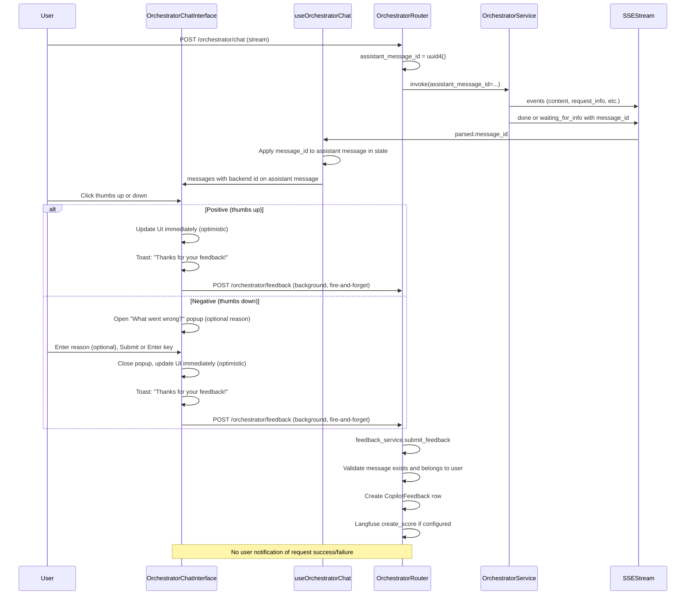
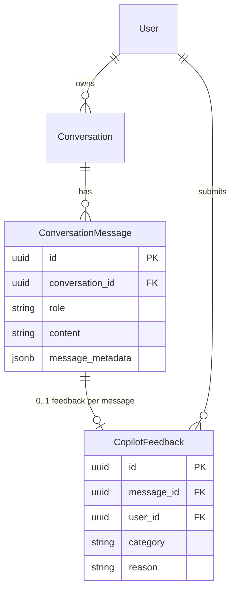

# Feedback Flow

User feedback (positive/negative) is collected on assistant responses and stored in the backend. One feedback per assistant message; duplicates return 409. When Langfuse is enabled, feedback is attached as a score to the trace.

## Overview

## Frontend Flow

1. **Message display**  
   For each assistant message, the UI uses `getAssistantMessageId(message)` which returns `message.assistantMessageId ?? message.id`. Feedback buttons are shown only when that value is a valid UUID (backend-assigned id).

2. **Positive feedback (thumbs up)**  
   User clicks thumbs up. The UI updates immediately (optimistic): the thumbs-up button is marked as selected. A toast is shown: "Thanks for your feedback!" (same toast system as errors, right corner). The feedback request is sent in the background (fire-and-forget); the user is not notified of request success or failure.

3. **Negative feedback (thumbs down)**  
   User clicks thumbs down. A popup opens with title "What went wrong?" and an optional reason textarea. User can add a comment and submit via the Submit button or by pressing Enter (Shift+Enter inserts a new line). On submit, the popup closes immediately and the UI updates optimistically (thumbs-down marked as selected). The same "Thanks for your feedback!" toast is shown. The feedback request is sent in the background (fire-and-forget); the user is not notified of request success or failure.

4. **Submit and error handling**  
   `FeedbackButtons` calls `feedbackService.submitFeedback({ assistantMessageId, category, reason })`, which sends `POST /orchestrator/feedback` with camelCase body `assistantMessageId`, `category`, `reason`. The request is fire-and-forget: no loading state, no success/failure toasts. Duplicate submissions (409) or other errors are not surfaced to the user.

Key files:

- [OrchestratorChatInterface.tsx](../services/frontend/app/src/features/chat/components/OrchestratorChatInterface.tsx) – `getAssistantMessageId`, `FeedbackButtons`, render of feedback per message.
- [feedbackService.ts](../services/frontend/app/src/features/chat/services/feedbackService.ts) – `submitFeedback` and request type with `assistantMessageId`.
- [useOrchestratorChat.ts](../services/frontend/app/src/features/chat/hooks/useOrchestratorChat.ts) – applies `message_id` from SSE `done` and `waiting_for_info` to the assistant message so the UI has the correct id for feedback.

## Backend Flow

1. **Request**  
   `POST /orchestrator/feedback` with body validated by `FeedbackCreateRequest`: `assistant_message_id` (UUID), `category` (positive | negative), optional `reason`.

2. **Validation**  
   Feedback service loads the `ConversationMessage` by `assistant_message_id`. If not found → 404. If the message’s conversation belongs to another user → 403. If `CopilotFeedback` already exists for that message → 409.

3. **Storage**  
   A `CopilotFeedback` row is created with `message_id = assistant_message_id`, `user_id`, `category`, `reason`. Commit.

4. **Langfuse**  
   If Langfuse is configured, `create_score` is called with `trace_id = to_trace_id(message.id)` (same trace id used when the response was streamed), `name = "user_feedback"`, `value = 1` (positive) or `0` (negative), `comment = reason`, `score_id = str(assistant_message_id)`. Failures in Langfuse do not fail the HTTP request.

Key files:

- [feedback.py](../services/backend/app/routers/feedback.py) – route and dependency wiring.
- [feedback_service.py](../services/backend/app/services/feedback_service.py) – `submit_feedback`, validation, `CopilotFeedback` creation, Langfuse score.
- [feedback.py schemas](../services/backend/app/schemas/feedback.py) – `FeedbackCreateRequest` with `assistant_message_id`, `category`, `reason`.

## Data Model

- **ConversationMessage.id** for assistant messages is the backend-generated id (see [id-management.md](id-management.md)). Feedback is stored with `CopilotFeedback.message_id = ConversationMessage.id`.
- One feedback per message: at most one `CopilotFeedback` row per `message_id`; duplicate submissions return 409.

## Request for More Info

When the orchestrator asks for more information, the stream ends with a **waiting_for_info** event (not **done**). The backend still sends `message_id` in that event. The frontend applies it the same way as for **done**, so the “request for more info” assistant message gets the correct backend id and feedback works for that message too. See [id-management.md](id-management.md) for when `message_id` is emitted.
