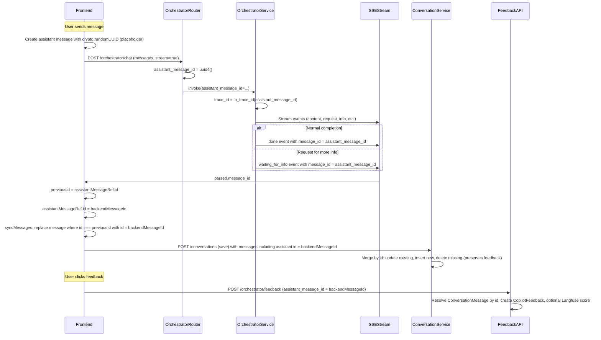
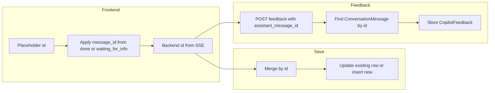

# ID Management

This document describes how message and trace ids are created, passed, and used so that feedback and observability stay aligned with the correct assistant response.

## Principle: Single Source of Truth for Assistant Message ID

The **backend** generates one UUID per assistant response at the start of each chat request. That id is used as:

1. The **ConversationMessage.id** when the frontend saves the conversation (so the message row in the DB has that id).
2. The **assistant_message_id** in the feedback API (so feedback is tied to that message).
3. The **Langfuse trace id** (truncated to 32 hex chars) for that response, so feedback can be attached as a score to the same trace.

The frontend does not generate the assistant message id for persistence or feedback; it uses a placeholder id until the backend sends `message_id` in SSE, then applies it.

## Lifecycle Diagram

## Backend: Where the ID Is Created and Used

| Step | Location | What happens |
|------|----------|----------------|
| Generate | [routers/orchestrator.py](../services/backend/app/routers/orchestrator.py) | On each `POST /orchestrator/chat`, `assistant_message_id = uuid4()`. Same id for streaming and non-streaming. |
| Pass to service | Same router | `service.invoke(..., assistant_message_id=assistant_message_id)`. |
| Trace id | [services/orchestrator_service.py](../services/backend/app/services/orchestrator_service.py) | `trace_id = to_trace_id(assistant_message_id)` (first 32 hex chars of UUID). Used for Langfuse/observability. |
| Emit to frontend | Same service | **done** event: `done_event["message_id"] = str(assistant_message_id)`. **waiting_for_info** event: `waiting_event["message_id"] = str(assistant_message_id)`. |
| Non-streaming response | [routers/orchestrator.py](../services/backend/app/routers/orchestrator.py) | Response body includes `response_id: assistant_message_id` so the client can use it for save and feedback. |

Trace id derivation:

- [services/tracing.py](../services/backend/app/services/tracing.py): `to_trace_id(assistant_message_id: UUID) -> str` returns `assistant_message_id.hex.lower()[:32]`.

## Frontend: Placeholder vs Backend ID

1. **On send**  
   The frontend creates one assistant message with `id: crypto.randomUUID()` and adds it to state. That id is only a placeholder.

2. **When SSE sends message_id**  
   The backend sends `message_id` in either:
   - **done** – normal completion of the response.
   - **waiting_for_info** – stream ended because the orchestrator is waiting for more user input (e.g. “request for more info”).

   In both cases, [useOrchestratorChat.ts](../services/frontend/app/src/features/chat/hooks/useOrchestratorChat.ts):
   - Reads `parsed.message_id` as `backendMessageId`.
   - Stores `previousId = assistantMessageRef.id` (the placeholder).
   - Sets `assistantMessageRef.id = backendMessageId`.
   - Calls `syncMessages` to replace the message whose id is `previousId` with the same message but `id: backendMessageId`.

3. **Save**  
   When the frontend persists the conversation, it sends all messages with their current ids. The assistant message now has the backend id, so the conversation service creates or updates a `ConversationMessage` with that id. Merge-by-id avoids deleting that row (and thus preserves any feedback already stored).

4. **Feedback**  
   The UI uses `getAssistantMessageId(message)` (`message.assistantMessageId ?? message.id`) and sends that as `assistantMessageId` in `POST /orchestrator/feedback`. After step 2, that value is the backend id, so the feedback API finds the correct `ConversationMessage` and stores `CopilotFeedback.message_id` accordingly.

## Conversation Save and Feedback Preservation

Conversations are updated with **merge-by-id** in [conversation_service.py](../services/backend/app/services/conversation_service.py):

- Messages in the request are identified by their **id**.
- Existing DB messages whose id is in the request are **updated** (role, content, metadata).
- Existing DB messages whose id is not in the request are **deleted** (and CASCADE removes their `CopilotFeedback`).
- Messages in the request whose id is not yet in the DB are **inserted**.

So:

- The frontend must send the **backend** assistant message id after it has applied it from SSE. If it sent the placeholder id, the backend would insert a new row with that id; later, when the user sends feedback with the real backend id, the feedback would point to a different row or none.
- Because the frontend replaces the placeholder with the backend id before save, the saved conversation has one assistant message row with the backend id, and feedback stored for that id remains valid across future saves (no delete of that row).

## Summary

| Id | Who generates | When | Used for |
|----|----------------|------|----------|
| Assistant message id | Backend | Start of each `/orchestrator/chat` request | ConversationMessage.id, feedback API, Langfuse trace id |
| User message id | Frontend | When user sends a message | ConversationMessage.id for user messages only; not used for feedback |
| Trace id | Backend | Derived from assistant_message_id | Langfuse trace (and optional score on feedback) |

Ensuring the frontend applies `message_id` from both **done** and **waiting_for_info** keeps “request for more info” responses aligned with the same id used in the DB and feedback API.
