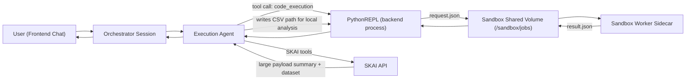
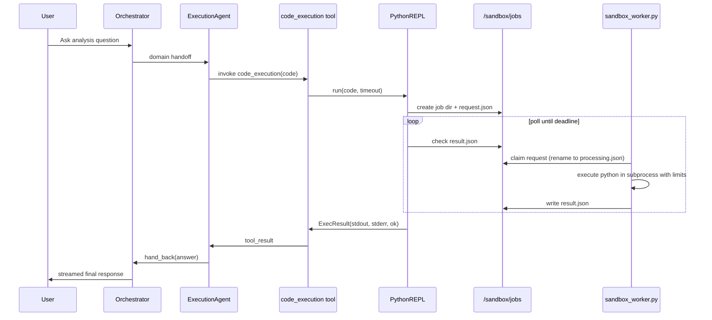
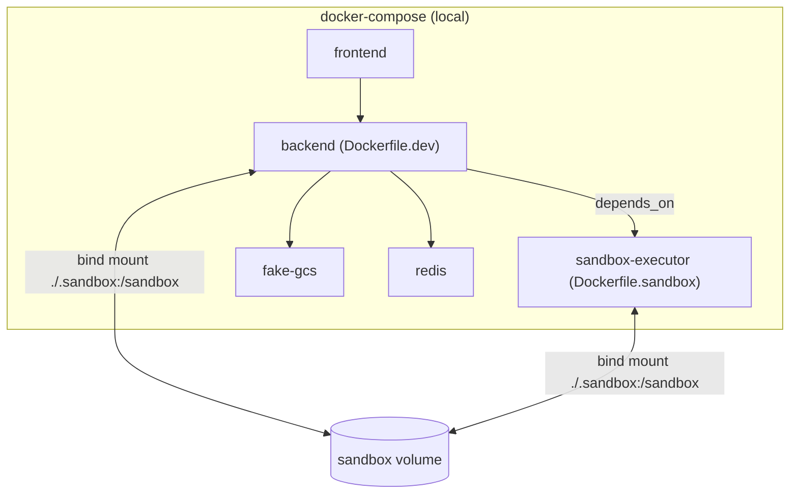
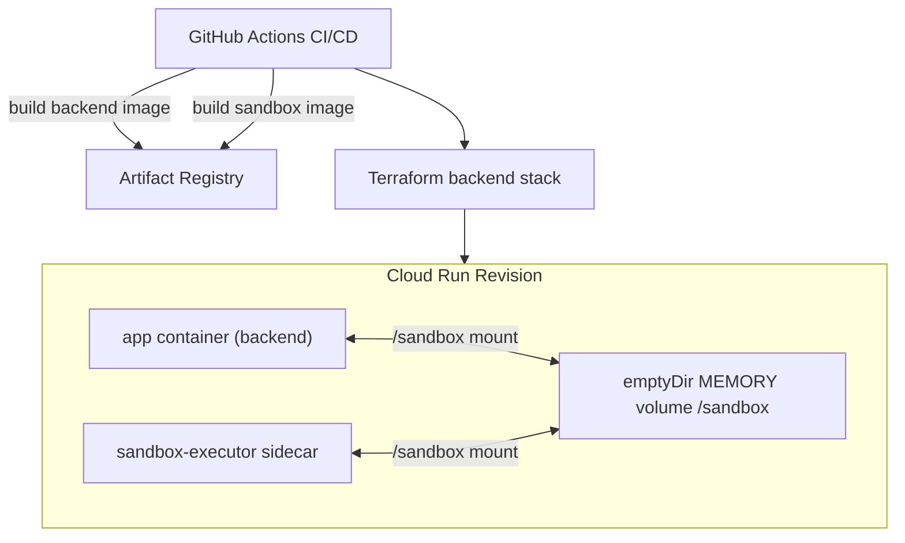

# Current State Report: Containerised Code Execution

Date: March 16, 2026  
Repository: `skai_copilot`

## 1) Scope and objective

This report documents the **currently implemented** containerised code execution approach in the backend, explains why this approach was selected (based on the Tomoro sandbox report), and provides a complete view of:

- architecture and execution flow
- local runtime behavior
- deployed runtime behavior
- security and operational characteristics
- gaps and recommended improvements

---

## 2) Executive summary

The implementation has moved to a **local containerised execution model** for Python analysis workloads:

- execution agents are configured to use `code_interpreter_mode: "local"` in current versions
- backend and sandbox executor communicate via a shared `/sandbox` volume and file-based job protocol
- a dedicated sandbox sidecar executes Python with `pandas`/`numpy` and process-level limits

This aligns with the research recommendation favoring container-based environments for scientific Python compatibility.  
Compared to the target architecture in the research report, the current design is strong on compatibility and portability, but it still has upgrade opportunities in isolation depth, permission model, and concurrency design.

---

## 3) Why this approach was selected

The Tomoro sandbox research concluded that container-based Linux execution is the best practical path for workloads requiring broad package compatibility (especially `numpy`/`pandas`) and open-source flexibility. The top recommendation was Docker + gVisor.

Key rationale from the research report:

- container/VM-backed runtimes best satisfy scientific Python compatibility
- plain Docker is fastest to operationalize
- Docker + gVisor provides stronger isolation with familiar container workflows

Source:
- [sandboxed-python-execution-report.md](/Users/malanevans/Developer/skai_copilot/docs/reports/sandboxed-python-execution-report.md)
- [tomoro-sandboxed-python-execution-report.pdf](/Users/malanevans/Developer/skai_copilot/docs/reports/tomoro-sandboxed-python-execution-report.pdf)

---

## 4) Current-state architecture (logical)

---

## 5) Runtime sequence (local code execution)

---

## 6) Implementation details

### 6.1 Versioning and mode selection

Current copilot versions use local mode:

- [v8.yaml](/Users/malanevans/Developer/skai_copilot/services/backend/app/config/versions/v8.yaml)
- [v7.yaml](/Users/malanevans/Developer/skai_copilot/services/backend/app/config/versions/v7.yaml)

Prior version `v6` used OpenAI-hosted code interpreter:

- [v6.yaml](/Users/malanevans/Developer/skai_copilot/services/backend/app/config/versions/v6.yaml)

Config model supports both:

- [versioning.py](/Users/malanevans/Developer/skai_copilot/services/backend/app/config/versioning.py)

### 6.2 Orchestrator and execution-agent integration

- Orchestrator creates one `PythonREPL` per session and injects into handoff execution agents.
- For local mode, execution tool `code_execution` is attached to execution agents.

Sources:
- [orchestrator.py](/Users/malanevans/Developer/skai_copilot/services/backend/app/copilot_agents/orchestrator.py)
- [execution.py](/Users/malanevans/Developer/skai_copilot/services/backend/app/tools/orchestrator/execution.py)
- [core.py](/Users/malanevans/Developer/skai_copilot/services/backend/app/tools/agent/core.py)

### 6.3 File-based job protocol

Backend-side `PythonREPL`:

- writes `request.json` into `/sandbox/jobs/<job_id>/`
- polls for `result.json`
- writes `cancelled` marker on timeout
- cleans up job folder when done

Worker-side `sandbox_worker.py`:

- claims jobs by atomically renaming `request.json` -> `processing.json`
- executes code and writes `result.json`
- emits timeout/failure statuses in structured JSON

Sources:
- [python_repl.py](/Users/malanevans/Developer/skai_copilot/services/backend/app/services/python_repl.py)
- [sandbox_worker.py](/Users/malanevans/Developer/skai_copilot/services/backend/app/services/sandbox_worker.py)

### 6.4 Code execution semantics

Execution is REPL-like:

- code is AST-parsed
- if the last statement is an expression, it is evaluated and printed
- otherwise script executes normally

This gives natural notebook-style behavior (trailing expressions produce output) while still executing full scripts.

Source:
- [sandbox_worker.py](/Users/malanevans/Developer/skai_copilot/services/backend/app/services/sandbox_worker.py)

### 6.5 Dataset handoff for large SKAI payloads

When SKAI tool responses are large:

- data is summarized for model context
- dataset is written as CSV to session data directory under `/sandbox/data/<session>/`
- agent is instructed to analyze CSV via code execution

Source:
- [tools.py](/Users/malanevans/Developer/skai_copilot/services/backend/app/tools/skai/tools.py)

### 6.6 Session cleanup

At end of orchestrator loop, session data directory is removed via `python_repl.cleanup()`.

Source:
- [orchestrator.py](/Users/malanevans/Developer/skai_copilot/services/backend/app/copilot_agents/orchestrator.py)

---

## 7) Local environment architecture

Local hardening present on `sandbox-executor`:

- `read_only: true`
- `tmpfs /tmp`
- `cap_drop: ALL`
- `no-new-privileges:true`
- `network_mode: none`
- `pids_limit`
- `mem_limit`

Source:
- [docker-compose.yml](/Users/malanevans/Developer/skai_copilot/docker-compose.yml)

Local startup command:

- `pnpm dev` -> `docker compose up`

Source:
- [package.json](/Users/malanevans/Developer/skai_copilot/package.json)

---

## 8) Deployed environment architecture

Deployment behavior:

- sandbox sidecar is enabled when `sandbox_image_url` is set
- shared `/sandbox` memory volume is mounted into both containers
- `PYTHON_SANDBOX_SHARED_DIR=/sandbox` passed to app
- DB migrations in runtime app are disabled; run as dedicated Cloud Run job

Sources:
- [terraform/services/backend/main.tf](/Users/malanevans/Developer/skai_copilot/terraform/services/backend/main.tf)
- [terraform/services/backend/variables.tf](/Users/malanevans/Developer/skai_copilot/terraform/services/backend/variables.tf)
- [workflow _backend.yml](/Users/malanevans/Developer/skai_copilot/.github/workflows/_backend.yml)

---

## 9) Current controls and characteristics

### 9.1 Security and isolation

Implemented controls:

- sidecar-level process limits and local container hardening (compose)
- subprocess-level limits in worker:
  - address space memory limit
  - CPU limit
  - file size limit
  - process/file-descriptor limits
- Python isolated mode (`-I`) and minimized env vars

### 9.2 Operational model

- asynchronous orchestration with synchronous code-execution call into file protocol
- persistent sidecar worker loop claims jobs from shared directory
- low-complexity operational footprint (no extra queue broker for sandbox jobs)
- supports scientific packages out-of-the-box in sandbox image (`pandas`, `numpy`)

### 9.3 Functional behavior

- supports iterative analysis by writing CSV artifacts for large tool payloads
- supports cancellation via timeout marker file
- supports per-session data paths and explicit cleanup

---

## 10) Gap analysis: current state vs target (from research)

| Area | Target architecture (research) | Current state | Status |
| --- | --- | --- | --- |
| Package compatibility | Full Linux scientific stack | `python:3.12-slim` + `pandas/numpy` | Good |
| Isolation boundary | Prefer Docker + gVisor / stronger isolation | Sidecar model, Cloud Run runtime isolation, local Docker hardening | Good/Partial |
| Per-run isolation | Fresh runtime/container per execution | Long-lived worker + subprocess-per-job | Partial |
| Filesystem minimization | Read-only base + scratch workspace | Local sidecar is read-only; shared `/sandbox` exists | Partial |
| Outbound network default | Disabled for executor | Local: disabled (`network_mode:none`); deployed: not explicitly sidecar-restricted in Terraform | Partial |
| Least privilege | Rootless where feasible | Backend drops privileges in prod entrypoint; sandbox image currently root by default | Partial |
| Data separation | Strong per-session isolation | Session directories exist, but shared dir permissions are broad | Partial |
| Concurrency strategy | Scalable and bounded | Single polling loop worker; serial job processing | Partial |

---

## 11) Risks and limitations

1. **Shared directory permissions are broad (`0777`)**
- increases accidental cross-session exposure risk on shared volume.

2. **Sandbox worker runs as root by default**
- image does not explicitly set non-root user.

3. **Execution path can block event loop under load**
- async tool wrapper calls synchronous `python_repl.run`.

4. **Single worker loop limits throughput**
- jobs are processed one-at-a-time in current worker implementation.

5. **Cleanup is not guarded by `finally`**
- abnormal exits can leave session artifacts.

---

## 12) Recommended improvements (prioritized)

### P0: security and correctness

1. Run sandbox sidecar as non-root user in image/runtime.
2. Replace permissive shared-dir mode with tighter ownership and per-session permissions.
3. Add guaranteed cleanup (`try/finally`) around session execution.

### P1: scalability and resilience

1. Offload `python_repl.run` via threadpool (`asyncio.to_thread`) to avoid event-loop blocking.
2. Add controlled parallel worker execution or shard executors.
3. Add structured metrics:
- queue depth
- execution latency
- timeout/cancel rate
- sandbox failures by reason

### P1: environment parity

1. Align local and deployed sandbox hardening controls.
2. Explicitly define deployed sidecar security context and network egress posture.

### P2: deeper isolation path

1. Move from shared-worker subprocess model to per-execution isolated runtime if threat model increases.
2. Evaluate explicit gVisor/runtime hardening profile in deployment documentation and controls.

---

## 13) How it works end-to-end (local vs deployed)

### Local

1. `pnpm dev` starts backend + sandbox sidecar via compose.
2. User query triggers orchestrator handoff to an execution agent.
3. Agent tool call `code_execution` writes job request under mounted `.sandbox/jobs`.
4. Sidecar worker executes code in subprocess with limits and writes result.
5. Backend returns result to agent, agent hands back answer to orchestrator, frontend receives SSE stream.

### Deployed

1. CI builds and pushes backend + sandbox images.
2. Terraform deploys Cloud Run service with app container + sandbox sidecar and shared in-memory `/sandbox` volume.
3. Runtime flow mirrors local protocol (request/result files in `/sandbox`), but inside Cloud Run multi-container instance.
4. Migrations are handled by dedicated Cloud Run job, not app startup.

---

## 14) Evidence map (primary implementation files)

- Orchestrator and handoff wiring  
  [copilot_agents/orchestrator.py](/Users/malanevans/Developer/skai_copilot/services/backend/app/copilot_agents/orchestrator.py)
- Execution-agent tool behavior  
  [copilot_agents/inference/execution_agent.py](/Users/malanevans/Developer/skai_copilot/services/backend/app/copilot_agents/inference/execution_agent.py)
- Local code execution tool  
  [tools/agent/core.py](/Users/malanevans/Developer/skai_copilot/services/backend/app/tools/agent/core.py)
- REPL request/response protocol  
  [services/python_repl.py](/Users/malanevans/Developer/skai_copilot/services/backend/app/services/python_repl.py)
- Sandbox worker execution engine  
  [services/sandbox_worker.py](/Users/malanevans/Developer/skai_copilot/services/backend/app/services/sandbox_worker.py)
- Dataset-to-CSV handoff logic  
  [tools/skai/tools.py](/Users/malanevans/Developer/skai_copilot/services/backend/app/tools/skai/tools.py)
- Local runtime topology  
  [docker-compose.yml](/Users/malanevans/Developer/skai_copilot/docker-compose.yml)
- Backend entrypoint/runtime privileges and migrations  
  [services/backend/docker-entrypoint.sh](/Users/malanevans/Developer/skai_copilot/services/backend/docker-entrypoint.sh)
- Sandbox image  
  [services/backend/Dockerfile.sandbox](/Users/malanevans/Developer/skai_copilot/services/backend/Dockerfile.sandbox)
- Deployment topology (Cloud Run + sidecar + volume)  
  [terraform/services/backend/main.tf](/Users/malanevans/Developer/skai_copilot/terraform/services/backend/main.tf)
- CI build/deploy for sandbox image  
  [.github/workflows/_backend.yml](/Users/malanevans/Developer/skai_copilot/.github/workflows/_backend.yml)
- Decision rationale report  
  [docs/reports/sandboxed-python-execution-report.md](/Users/malanevans/Developer/skai_copilot/docs/reports/sandboxed-python-execution-report.md)

