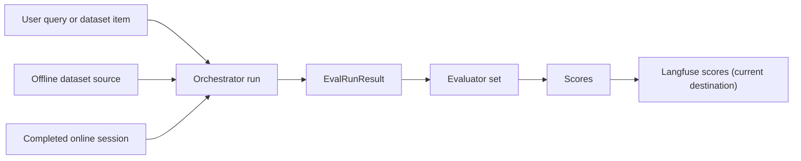

# Current State Report: Evaluation Framework (Offline and Online)

Date: March 16, 2026  
Repository: `skai_copilot`

## 1) Scope and objective

This report documents the **currently implemented** evaluation framework for SKAI Copilot across:

- offline evaluations (dataset-driven)
- online evaluations (real-session, end-of-session)
- metric definitions, formulas, scales, and trigger conditions
- observability destination and coupling boundaries
- current strengths, limitations, and improvement opportunities

Primary implementation sources:
- [run_evaluations.py](/Users/malanevans/Developer/skai_copilot/services/backend/app/evaluation/run_evaluations.py)
- [runner.py](/Users/malanevans/Developer/skai_copilot/services/backend/app/evaluation/runner.py)
- [evaluators.py](/Users/malanevans/Developer/skai_copilot/services/backend/app/evaluation/evaluators.py)
- [online_evaluation.py](/Users/malanevans/Developer/skai_copilot/services/backend/app/evaluation/online_evaluation.py)
- [orchestrator.py](/Users/malanevans/Developer/skai_copilot/services/backend/app/copilot_agents/orchestrator.py)
- [orchestrator_service.py](/Users/malanevans/Developer/skai_copilot/services/backend/app/services/orchestrator_service.py)
- [schemas/evaluation.py](/Users/malanevans/Developer/skai_copilot/services/backend/app/schemas/evaluation.py)

---

## 2) Executive summary

The framework is functionally mature and already unifies most scoring logic across offline and online paths via shared evaluator functions.

What works well now:

- one shared evaluation contract (`EvalRunResult`) across modes
- broad metric set: direct/system, LLM-as-judge quality/safety, groundedness, archetype/classification, criteria-fit
- online evaluations run asynchronously and do not block user response
- tests cover core evaluator behavior and online dispatch behavior

Key constraint:

- **Langfuse is the current score destination**, and score persistence is currently implemented directly through Langfuse APIs.
- Evaluation *logic* is reusable, but evaluation *storage/analytics* is not yet sink-abstracted.

---

## 3) Current architecture (logical)

Offline and online share evaluator primitives, but differ in trigger point and evaluator subset.

---

## 4) Evaluation data model and run modes

### 4.1 Core objects

- Dataset item schema: `EvalDatasetItem` (input, chat history, optional expected outputs/criteria/archetype, metadata, answerability flag) in [schemas/evaluation.py](/Users/malanevans/Developer/skai_copilot/services/backend/app/schemas/evaluation.py#L23).
- Run result schema: `EvalRunResult` (content, events, latency, completion, turn count, steps, trace id, plan completion, predicted archetype) in [schemas/evaluation.py](/Users/malanevans/Developer/skai_copilot/services/backend/app/schemas/evaluation.py#L102).

### 4.2 Offline modes

- `create_dataset`: register/update dataset in Langfuse from JSONL ([dataset_source.py](/Users/malanevans/Developer/skai_copilot/services/backend/app/evaluation/dataset_source.py#L41)).
- `run_evals`:
  - `mode=langfuse`: fetch dataset by name and run via `dataset.run_experiment(...)` ([run_evaluations.py](/Users/malanevans/Developer/skai_copilot/services/backend/app/evaluation/run_evaluations.py#L255)).
  - `mode=local`: load local JSONL and run orchestrator directly ([run_evaluations.py](/Users/malanevans/Developer/skai_copilot/services/backend/app/evaluation/run_evaluations.py#L287)).

### 4.3 Online mode

- Triggered when session is complete and Langfuse is enabled; scheduled as background task ([orchestrator_service.py](/Users/malanevans/Developer/skai_copilot/services/backend/app/services/orchestrator_service.py#L291)).
- Session is transformed into `EvalRunResult`, then scored ([orchestrator.py](/Users/malanevans/Developer/skai_copilot/services/backend/app/copilot_agents/orchestrator.py#L1222)).

---

## 5) Complete metric catalogue (all current metrics)

## 5.1 Direct/system metrics

Implemented in `direct_metrics` in [evaluators.py](/Users/malanevans/Developer/skai_copilot/services/backend/app/evaluation/evaluators.py#L182).

| Metric | Scale | How it is computed now | Offline | Online |
| --- | --- | --- | --- | --- |
| `latency_seconds` | `>= 0` float | End-to-end elapsed time from orchestrator run result | Yes | Yes |
| `number_of_turns` | integer | Turn count in run result | Yes | Yes |
| `number_of_tool_calls` | integer | Counts both `tool_call` and `tool_result` events | Yes | Yes |
| `tool_call_waste` | integer | Repeated `tool_call` with same `(tool_name, canonicalized tool_args)` | Yes | Yes |
| `tool_call_waste_ratio` | float `0..1` | `repeated_tool_calls / tool_call_events_count`, else `0.0` | Yes | Yes |
| `error_count` | integer | Number of `error` events | Yes | Yes |
| `has_errors` | `0.0` or `1.0` | `1.0` if `error_count > 0`, else `0.0` | Yes | Yes |
| `is_complete` | `0.0` or `1.0` | Float cast of run completion bool | Yes | Yes |
| `plan_completion` | float | Offline: mean of `plan_progress`; online: `all(plan_progress)` cast through schema to float | Yes | Yes |

Event parsing logic source:
- [_parse_events in evaluators.py](/Users/malanevans/Developer/skai_copilot/services/backend/app/evaluation/evaluators.py#L47)

---

## 5.2 LLM-as-judge metrics

Judge scoring model and output:

- Model: `gpt-5-mini` via structured output ([evaluators.py](/Users/malanevans/Developer/skai_copilot/services/backend/app/evaluation/evaluators.py#L377)).
- Rating classes: `ExtremelyPoor`, `Poor`, `Fair`, `Good`, `Excellent` mapped to `0.0, 0.2, 0.4, 0.6, 1.0` ([schemas/evaluation.py](/Users/malanevans/Developer/skai_copilot/services/backend/app/schemas/evaluation.py#L90)).

Current LLM metrics:

| Metric | Requires reference answer | Requires tool results | Notes | Offline | Online |
| --- | --- | --- | --- | --- | --- |
| `relevance` | No | No | Does response address user question | Yes | Yes |
| `clarity` | No | No | Readability/coherence | Yes | Yes |
| `completeness` | No | No | Coverage of requested aspects | Yes | Yes |
| `safety` | No | No | Harm/appropriateness risk | Yes | Yes |
| `faithfulness` | No | Yes | Grounding against tool outputs | Yes | Yes |
| `factual_accuracy_grounded` | No | Yes | Factual correctness against tool outputs | Yes | Yes |
| `factual_accuracy` | Yes | No | Skipped when no `expected_output` | Yes | No |
| `answer_criteria` | No | No | Rubric-fit against `expected_answer_criteria` | Yes | No |

Key logic:

- `factual_accuracy` skip when reference missing: [evaluators.py](/Users/malanevans/Developer/skai_copilot/services/backend/app/evaluation/evaluators.py#L371)
- Faithfulness skip when no tool results: [evaluators.py](/Users/malanevans/Developer/skai_copilot/services/backend/app/evaluation/evaluators.py#L466)
- Criteria evaluator: [evaluators.py](/Users/malanevans/Developer/skai_copilot/services/backend/app/evaluation/evaluators.py#L308)

Online evaluator subset source:
- [online_evaluation.py](/Users/malanevans/Developer/skai_copilot/services/backend/app/evaluation/online_evaluation.py#L12)

---

## 5.3 Classification metric

| Metric | Scale | Condition | Offline | Online |
| --- | --- | --- | --- | --- |
| `archetype_match` | `0.0` or `1.0` | Compares `expected_archetype` with orchestrator `predicted_archetype`; skips if either missing | Yes | No |

Source:
- [archetype_classification_evaluator](/Users/malanevans/Developer/skai_copilot/services/backend/app/evaluation/evaluators.py#L253)

---

## 5.4 Human feedback metric (trace-level observability)

Outside the automated evaluator set, the framework also attaches a user feedback score to traces:

| Metric | Scale | Trigger | Purpose |
| --- | --- | --- | --- |
| `user_feedback` | BOOLEAN (`1` positive, `0` negative) | User submits feedback on assistant message | Human quality signal linked to trace |

Source:
- [feedback_service.py](/Users/malanevans/Developer/skai_copilot/services/backend/app/services/feedback_service.py#L164)

---

## 6) Offline evaluation flow in detail

1. Resolve dataset source:
- Langfuse by name or local JSONL ([run_evaluations.py](/Users/malanevans/Developer/skai_copilot/services/backend/app/evaluation/run_evaluations.py#L255), [run_evaluations.py](/Users/malanevans/Developer/skai_copilot/services/backend/app/evaluation/run_evaluations.py#L287)).

2. Run orchestrator per item:
- `run_orchestrator_for_item(...)` creates trace id, executes session, supports clarification loops ([runner.py](/Users/malanevans/Developer/skai_copilot/services/backend/app/evaluation/runner.py#L24)).
- Clarification behavior:
  - if `request_info` has actions, first action is auto-selected
  - else default reply is injected
  - loop stops after >4 turns ([runner.py](/Users/malanevans/Developer/skai_copilot/services/backend/app/evaluation/runner.py#L73)).

3. Evaluate and attach scores:
- Evaluator list in [run_evaluations.py](/Users/malanevans/Developer/skai_copilot/services/backend/app/evaluation/run_evaluations.py#L54).
- Score writes in [run_evaluations.py](/Users/malanevans/Developer/skai_copilot/services/backend/app/evaluation/run_evaluations.py#L132).

4. Item filtering:
- Items with `answerable_by_dataset=false` are currently skipped ([run_evaluations.py](/Users/malanevans/Developer/skai_copilot/services/backend/app/evaluation/run_evaluations.py#L124)).

---

## 7) Online evaluation flow in detail

1. Session completion path:
- service emits final event, then schedules `session.run_online_evals(trace_id)` non-blocking when complete and Langfuse enabled ([orchestrator_service.py](/Users/malanevans/Developer/skai_copilot/services/backend/app/services/orchestrator_service.py#L291)).

2. Session-to-eval conversion:
- uses first user message + full event stream + final answer + aggregate timing/turns ([orchestrator.py](/Users/malanevans/Developer/skai_copilot/services/backend/app/copilot_agents/orchestrator.py#L1225)).

3. Evaluate and write:
- online evaluator set executes and writes scores to trace ([online_evaluation.py](/Users/malanevans/Developer/skai_copilot/services/backend/app/evaluation/online_evaluation.py#L23)).

Dispatch behavior is validated in tests:
- [test_orchestrator_service.py](/Users/malanevans/Developer/skai_copilot/services/backend/app/tests/unit/services/test_orchestrator_service.py#L220)

---

## 8) Langfuse role and coupling boundaries

Current state:

- Langfuse is the active score/tracing destination in both offline and online scoring writes.
- Langfuse is optional by configuration; client returns `None` when disabled ([packages/langfuse/client.py](/Users/malanevans/Developer/skai_copilot/packages/langfuse/client.py#L49)).

Practical coupling today:

- Evaluator logic itself is local Python and reusable.
- Persistence and analytics path is currently implemented via direct `create_score(...)` calls and no alternative sink.

Implication:

- Framework should be described as **evaluation-core + Langfuse sink (current)** rather than Langfuse-native evaluation.

---

## 9) Strengths

- Shared core evaluator logic across offline and online paths.
- Clear typed contracts for dataset items and run results.
- Strong metric breadth including groundedness and safety dimensions.
- Structured judge outputs with deterministic score mapping.
- Non-blocking online dispatch with explicit test coverage.

---

## 10) Current gaps and risks

1. Inconsistent `plan_completion` semantics:
- offline ratio vs online boolean-derived value.

2. Local mode dataset path contract ambiguity:
- current local loader builds `evaluation/datasets/{dataset_name}.jsonl`, while docs and some surfaces present local mode as path-oriented.

3. Criteria/reference blending in Langfuse dataset creation:
- `expected_output` can be populated from `expected_answer_criteria`, which may blur the meaning of factual-reference metrics in some paths.

4. No non-Langfuse sink:
- when Langfuse is unavailable, scores are not persisted elsewhere.

5. Unanswerable items are skipped:
- no metric yet for correct abstention or clarification quality on those cases.

---

## 11) Improvement opportunities (prioritized)

1. Introduce `EvaluationSink` abstraction:
- `LangfuseSink` (current behavior), `JsonlSink`/DB sink for local and CI observability.

2. Standardize metric semantics:
- normalize `plan_completion` to one definition (recommended: ratio `0..1`).
- clarify or rename `number_of_tool_calls` if tool results remain included.

3. Tighten dataset contracts:
- separate `expected_output` (reference answer) from rubric/criteria fields end-to-end.
- enforce explicit local path vs dataset-name behavior in CLI/API and docs.

4. Expand quality coverage:
- add abstention/clarification metrics for `answerable_by_dataset=false` items.
- add orchestration-step and agent-selection evaluators (schema placeholders already exist).